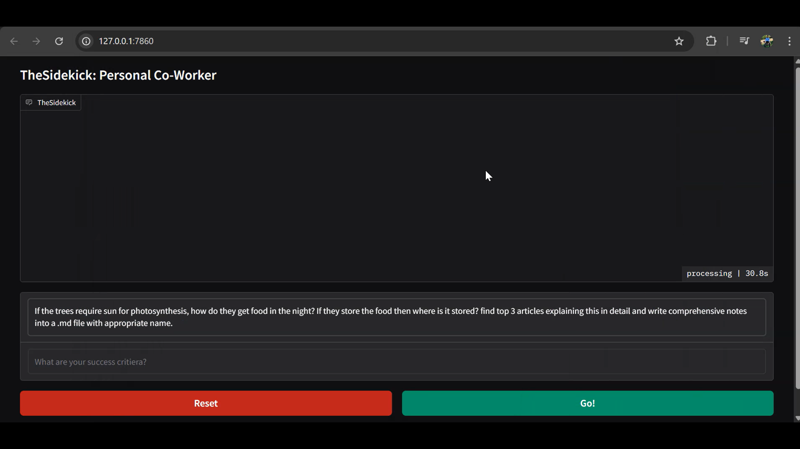
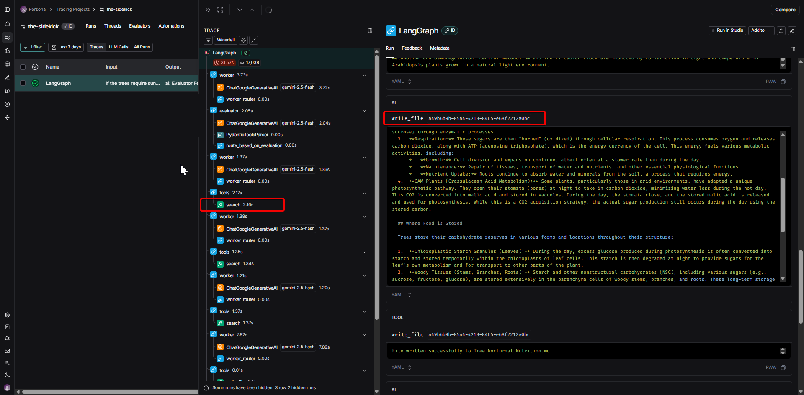
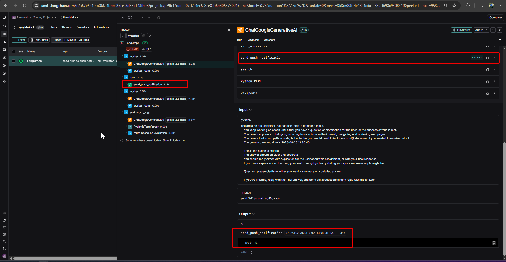
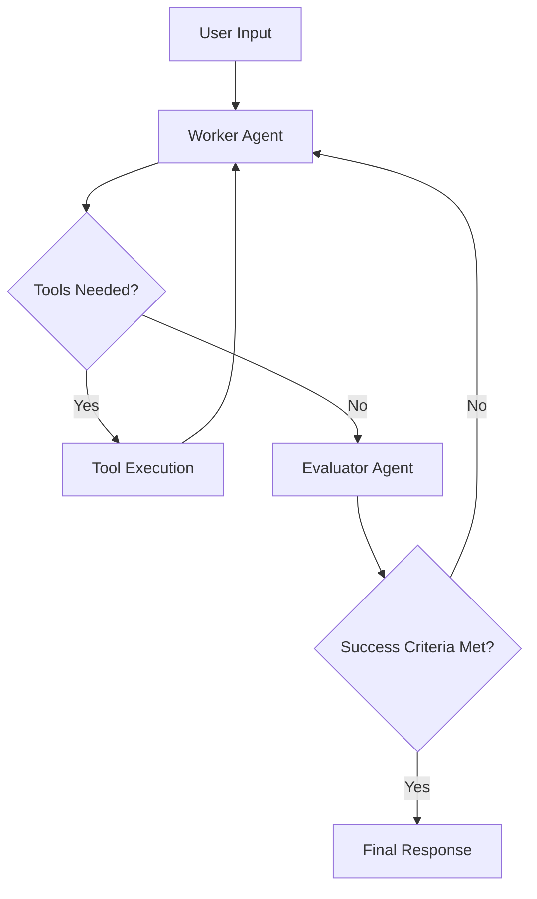

# TheSidekick

> An intelligent AI assistant that autonomously executes tasks through multi-agent orchestration and web automation.


## ✨ Sample Output

### Gradio Interface:



---
### LangSmith Tracing:



---


---


## ✨ Features

- **Multi-Agent Architecture**: Worker and evaluator agents collaborate to ensure task completion
- **Web Automation**: Integrated Playwright for browser-based interactions
- **Code Execution**: Built-in Python runtime for data processing and analysis  
- **Adaptive Learning**: Continuous feedback loops with success criteria evaluation
- **Persistent Memory**: Conversation state management across sessions
- **Tool Orchestration**: Dynamic routing between specialized capabilities

## 🚀 Quick Start

### Prerequisites
- Python 3.8+
- Google Generative AI API key

### Installation

```bash
# Clone the repository
git clone https://github.com/yourusername/thesidekick.git
cd thesidekick

# Install dependencies
pip install -r requirements.txt

# Set up environment variables
cp .env.sample .env
# Add your GOOGLE_API_KEY to .env
```

### Usage

```shell
# app.py contains the gradio app code implementation
python app.py
# or
uv run app.py
```

## 🏗️ Architecture



## 🛠️ Core Components

| Component | Purpose |
|-----------|---------|
| **Worker Agent** | Task execution and tool orchestration |
| **Evaluator Agent** | Success criteria assessment and feedback |
| **StateGraph** | Workflow management and agent routing |
| **Tool System** | Web automation and code execution |

## 📋 Configuration

Create a `.env` file with your API configurations:

```env
PERSISTENCE_TYPE=""
SQLITE_DB_PATH=""


GOOGLE_API_KEY=""
TAVILY_API_KEY=""
SERPER_API_KEY=""


PUSHOVER_TOKEN=""
PUSHOVER_USER=""


LANGSMITH_TRACING="true"
LANGSMITH_ENDPOINT="https://api.smith.langchain.com"
LANGSMITH_API_KEY="..."
LANGSMITH_PROJECT="the-sidekick"

```


